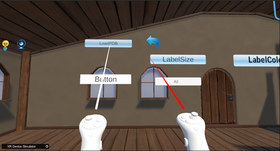
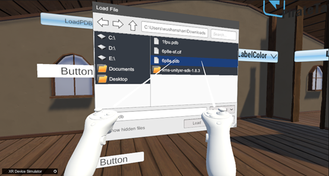
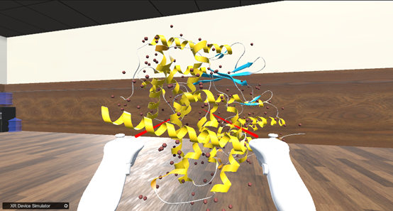

1.如下图所示，使用手柄点击“LoadPDB”按钮  
As shown in the following figure,Click on the "LoadPDB" button using the controller  
  
&emsp;&emsp;&emsp;&emsp;&emsp;&emsp;&emsp;&emsp;&emsp;&emsp;&emsp;&emsp;&emsp;&emsp;&emsp;图1. LoadPDB  

2.如下图所示，在弹出来的文件浏览器选择自己下载好的pdb文件  
As shown in the following figure,Select the downloaded PDB file in the pop-up file browser  
   
&emsp;&emsp;&emsp;&emsp;&emsp;&emsp;&emsp;&emsp;&emsp;&emsp;&emsp;&emsp;&emsp;&emsp;&emsp;图2. 文件浏览器  

3.如下图所示，加载出来的蛋白质模型（以6p8e.pdb为例）  
As shown in the following figure,, the loaded protein model （Take 6p8e.pdb as an example）  
   
&emsp;&emsp;&emsp;&emsp;&emsp;&emsp;&emsp;&emsp;&emsp;&emsp;&emsp;&emsp;&emsp;&emsp;&emsp;图3. 6p8e模型  

