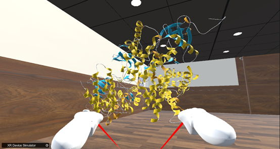

如何进行分子对齐：  
How to perform molecular alignment  
1. 加载两个分子后点击Align按钮  
After loading two molecules, click the Align button  
  
&emsp;&emsp;&emsp;&emsp;&emsp;&emsp;&emsp;&emsp;&emsp;&emsp;&emsp;&emsp;
图25. Align按钮，用来对齐分子  
2. 如下图所示，对齐前：  
As shown in the following figure,Before alignment  
   
&emsp;&emsp;&emsp;&emsp;&emsp;&emsp;&emsp;&emsp;&emsp;&emsp;&emsp;&emsp;
图26.对齐之前的分子模型  
3. 如下图所示，对齐后：  
As shown in the following figure,After alignment  
   
&emsp;&emsp;&emsp;&emsp;&emsp;&emsp;&emsp;&emsp;&emsp;&emsp;&emsp;&emsp;
图27.对齐后的分子模型  
    
&emsp;&emsp;&emsp;&emsp;&emsp;&emsp;&emsp;&emsp;&emsp;&emsp;&emsp;&emsp;
图28.对齐后的模型（卡通模型）  
