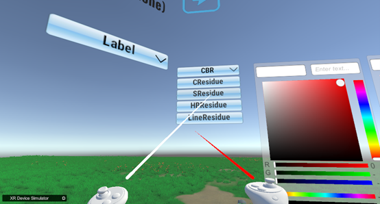
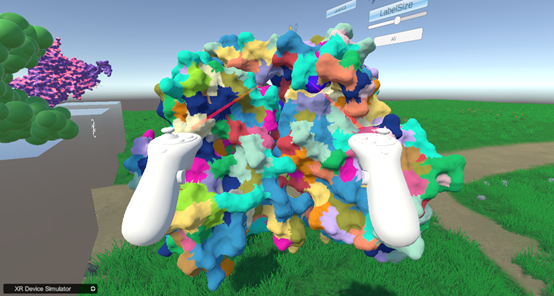

根据residue划分不同色块（以6p8e.pdb为例）：  
Divide different color blocks based on resolution (using 6p8e. pdb as an example)  
1.在右侧“CBR”按钮选择对应模型的选项  
Select the corresponding model option on the "CBR" button on the right  
   
&emsp;&emsp;&emsp;&emsp;&emsp;&emsp;&emsp;&emsp;&emsp;&emsp;&emsp;&emsp;
图23.CBR（残基的颜色）下拉栏  
2.划分后的模型  
Divided model  
   
&emsp;&emsp;&emsp;&emsp;&emsp;&emsp;&emsp;&emsp;&emsp;&emsp;&emsp;&emsp;
图24.根据残基划分完颜色的模型  
