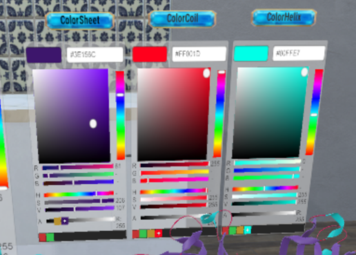
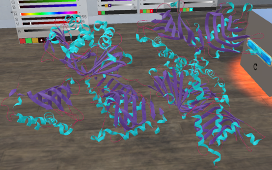

# 9. Secondary structure color    
As shown in the following figure, we can adjust the colors separately in the following three palettes (ColorSheet, ColorCoil, ColorHelix) :   
  
&emsp;&emsp;&emsp;&emsp;&emsp;&emsp;&emsp;&emsp;&emsp;
Figure 9.1 Secondary Structure Color palette    

 
As shown in the following figure, adjusted model after the opteration in Figure 29:  
  
&emsp;&emsp;&emsp;&emsp;&emsp;&emsp;&emsp;&emsp;&emsp;
Figure 9.2 The model after color adjustment  
