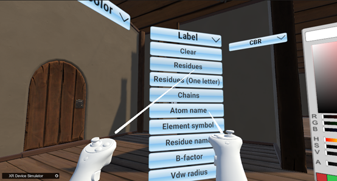
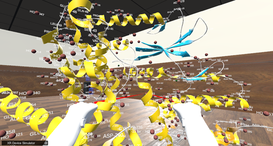
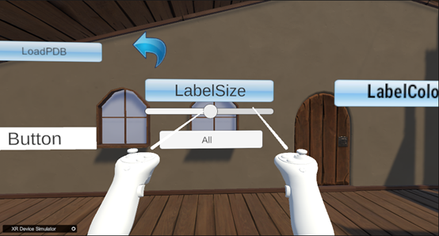
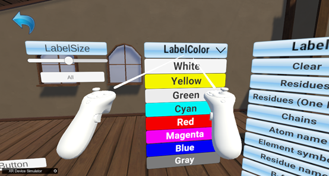
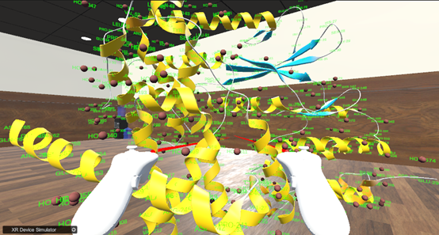

How to display labels（Take 6p8e.pdb as an example）:  
As shown in the following figure,Select the label to be displayed in the Label dropdown menu  
  
&emsp;&emsp;&emsp;&emsp;&emsp;&emsp;&emsp;&emsp;&emsp;&emsp;&emsp;&emsp;&emsp;&emsp;
Chart 16.Label Dropdown list  
  
&emsp;&emsp;&emsp;&emsp;&emsp;&emsp;&emsp;&emsp;&emsp;&emsp;&emsp;&emsp;&emsp;&emsp;
Chart 17.Models with molecular labels  
As shown in the following figure, Adjust the label font size through the slider under LabelSize  
  
&emsp;&emsp;&emsp;&emsp;&emsp;&emsp;&emsp;&emsp;&emsp;&emsp;&emsp;
Chart 18.LabelSize slider, adjust label size  
As shown in the following figure, Switching Label Colors through LabelColor  
  
&emsp;&emsp;&emsp;&emsp;&emsp;&emsp;&emsp;&emsp;&emsp;&emsp;&emsp;
Chart 19.LabelColor dropdown bar, adjust label color  
As shown in the following figure, Label after switching green  
  
&emsp;&emsp;&emsp;&emsp;&emsp;&emsp;&emsp;&emsp;&emsp;&emsp;&emsp;&emsp;
Chart 20.Green labels after switching colors  