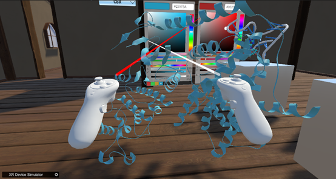

How to change model colors（Take 6p8e.pdb as an example）:  
As shown in the following figure, Select a color in the right color palette  
  
&emsp;&emsp;&emsp;&emsp;&emsp;&emsp;&emsp;&emsp;&emsp;&emsp;&emsp;&emsp;&emsp;&emsp;&emsp;
Chart 10. palette  
As shown in the following figure,Model with selected colors  
  
&emsp;&emsp;&emsp;&emsp;&emsp;&emsp;&emsp;&emsp;&emsp;&emsp;&emsp;&emsp;&emsp;
Chart 11. Model with selected colors  
