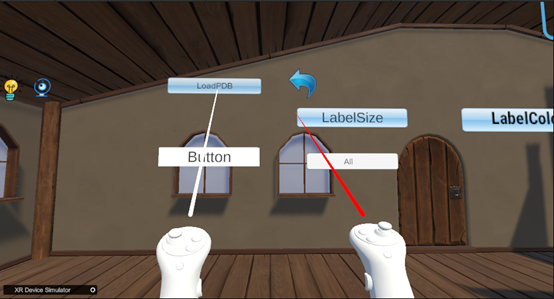
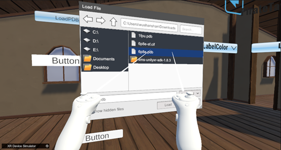
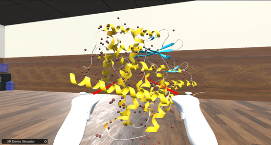

As shown in the following figure,Click on the "LoadPDB" button using the controller  
  
&emsp;&emsp;&emsp;&emsp;&emsp;&emsp;&emsp;&emsp;&emsp;&emsp;&emsp;&emsp;&emsp;&emsp;&emsp;Chart 1. LoadPDB  

As shown in the following figure,Select the downloaded PDB file in the pop-up file browser  
   
&emsp;&emsp;&emsp;&emsp;&emsp;&emsp;&emsp;&emsp;&emsp;&emsp;&emsp;&emsp;&emsp;&emsp;&emsp;Chart 2. File Browser  

As shown in the following figure, the loaded protein model （Take 6p8e.pdb as an example）  
   
&emsp;&emsp;&emsp;&emsp;&emsp;&emsp;&emsp;&emsp;&emsp;&emsp;&emsp;&emsp;&emsp;&emsp;&emsp;Chart 3. 6p8e model  

