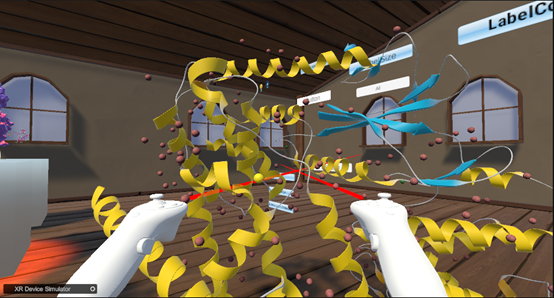
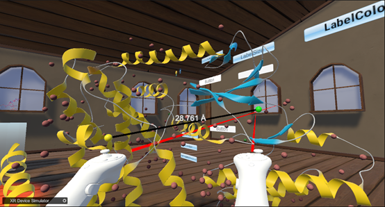

How to measure the distance between molecules（Take 6p8e.pdb as an example）  
As shown in the following figure,Select two molecules  
  
&emsp;&emsp;&emsp;&emsp;&emsp;&emsp;&emsp;&emsp;&emsp;&emsp;&emsp;&emsp;&emsp;&emsp;
Chart 12. First, select the first molecule  
As shown in the following figure,After selecting the molecules, there is a line connecting them, which will display the distance  
  
&emsp;&emsp;&emsp;&emsp;&emsp;&emsp;&emsp;&emsp;&emsp;&emsp;
Chart 13. After selecting two molecules, measure the distance between the two molecules  
As shown in the following figure, Adjusting the color of lines through the color palette  
  
&emsp;&emsp;&emsp;&emsp;&emsp;&emsp;&emsp;&emsp;&emsp;&emsp;&emsp;&emsp;&emsp;&emsp;
Chart 14. Color palette settings for distance measurement lines  
  
&emsp;&emsp;&emsp;&emsp;&emsp;&emsp;&emsp;&emsp;&emsp;&emsp;&emsp;&emsp;&emsp;&emsp;
Chart 15.Distance measurement line after changing color  
