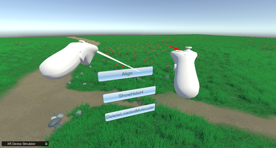
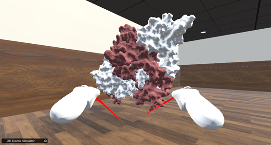
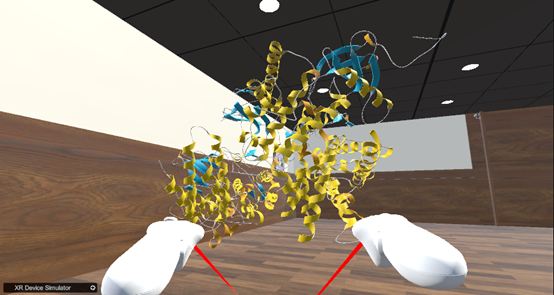

How to perform molecular alignment  
After loading two molecules, click the Align button  
  
&emsp;&emsp;&emsp;&emsp;&emsp;&emsp;&emsp;&emsp;&emsp;&emsp;&emsp;&emsp;
Chart 25. Align button, used to align molecules  
As shown in the following figure,Before alignment  
   
&emsp;&emsp;&emsp;&emsp;&emsp;&emsp;&emsp;&emsp;&emsp;&emsp;&emsp;&emsp;
Chart 26.Align the previous molecular model  
As shown in the following figure,After alignment  
   
&emsp;&emsp;&emsp;&emsp;&emsp;&emsp;&emsp;&emsp;&emsp;&emsp;&emsp;&emsp;
Chart 27.Aligned molecular model  
    
&emsp;&emsp;&emsp;&emsp;&emsp;&emsp;&emsp;&emsp;&emsp;&emsp;&emsp;&emsp;
Chart 28.Aligned model (cartoon model)  
