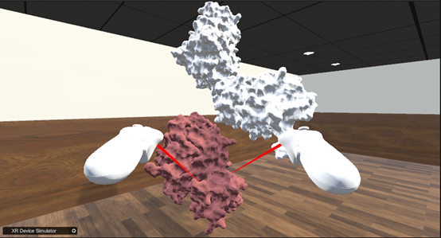

# 8. How to perform molecular alignment    
After loading two molecules, click the Align button.  
  
&emsp;&emsp;&emsp;&emsp;&emsp;&emsp;&emsp;&emsp;&emsp;
Figure 8.1 Align button, used to align molecules    

 
As shown in the following figure,Before alignment.  
   
&emsp;&emsp;&emsp;&emsp;&emsp;&emsp;&emsp;&emsp;&emsp;
Figure 8.2 Align the previous molecular model    

 
As shown in the following figure,After alignment.  
   
&emsp;&emsp;&emsp;&emsp;&emsp;&emsp;&emsp;&emsp;&emsp;&emsp;&emsp;
Figure 8.3 Aligned molecular model    

 
    
&emsp;&emsp;&emsp;&emsp;&emsp;&emsp;&emsp;&emsp;&emsp;&emsp;
Figure 8.4 Aligned model (cartoon model)    
