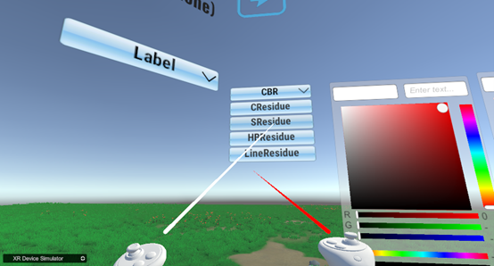
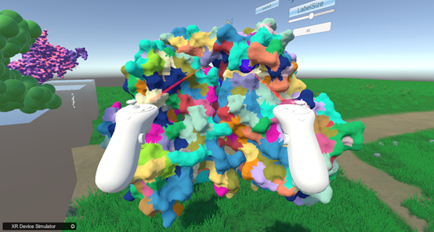

Divide different color blocks based on resolution (using 6p8e. pdb as an example)  
Select the corresponding model option on the "CBR" button on the right  
   
&emsp;&emsp;&emsp;&emsp;&emsp;&emsp;&emsp;&emsp;&emsp;&emsp;&emsp;&emsp;
Chart 23.CBR (color of residue) dropdown menu  
Divided model  
   
&emsp;&emsp;&emsp;&emsp;&emsp;&emsp;&emsp;&emsp;&emsp;&emsp;&emsp;&emsp;
Chart 24.A model that divides colors based on residues  
