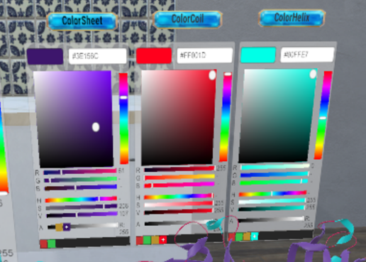
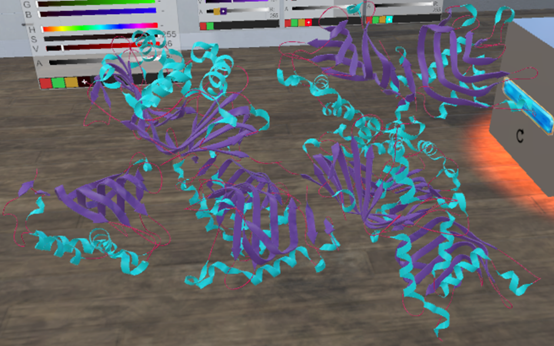

# 二级结构颜色：  
如下图所示，在后面三个调色板（ColorSheet,ColorCoil,ColorHelix）分别调整颜色  
   
&emsp;&emsp;&emsp;&emsp;&emsp;&emsp;&emsp;&emsp;&emsp;&emsp;&emsp;&emsp;
图29.二级结构调色板  

如下图所示，调整后的模型  
   
&emsp;&emsp;&emsp;&emsp;&emsp;&emsp;&emsp;&emsp;&emsp;&emsp;&emsp;&emsp;
图30.调完颜色后的模型  
