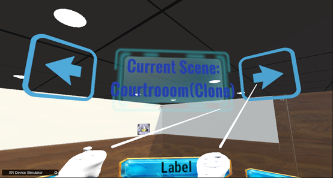
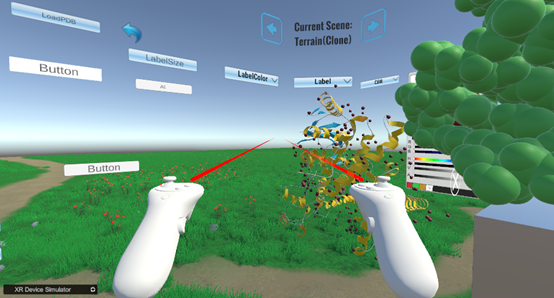

# 如何切换场景：  
1. 如下图所示，在右上角“Current Scene”选择场景  
   
&emsp;&emsp;&emsp;&emsp;&emsp;&emsp;&emsp;&emsp;&emsp;&emsp;&emsp;&emsp;
图21.切换场景按钮  

2. 如下图所示，切换后的场景  
   
&emsp;&emsp;&emsp;&emsp;&emsp;&emsp;&emsp;&emsp;&emsp;&emsp;&emsp;&emsp;
图22.草地场景  

