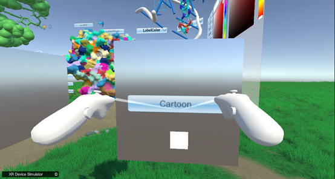
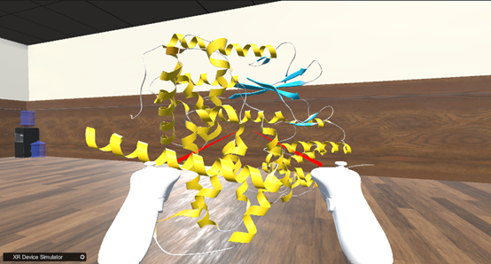
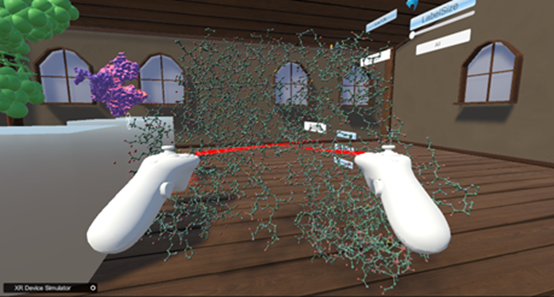
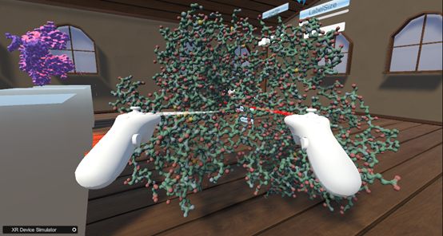
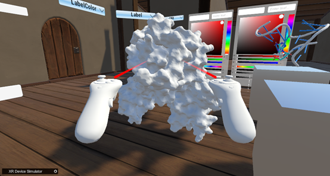
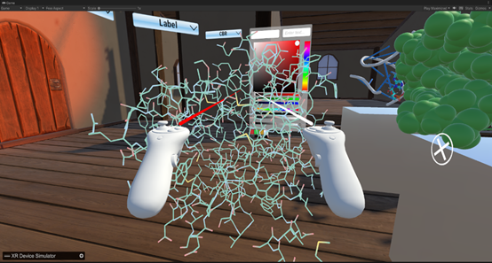

如何切换蛋白质模型（以6p8e.pdb为例）：  
1. 如下图所示，在前面的模型展示下方点击按钮切换模型（以Cartoon模型为例）  
  
&emsp;&emsp;&emsp;&emsp;&emsp;&emsp;&emsp;&emsp;&emsp;&emsp;&emsp;&emsp;&emsp;&emsp;&emsp;图4. ‘Cartoon’按钮  
2. 如下图所示，切换后的模型  
  
&emsp;&emsp;&emsp;&emsp;&emsp;&emsp;&emsp;&emsp;&emsp;&emsp;&emsp;&emsp;&emsp;&emsp;&emsp;图5. 6p8e卡通模型  
3.其他不同的模型  
（1）VDW模型（VDW Model）：  
  
&emsp;&emsp;&emsp;&emsp;&emsp;&emsp;&emsp;&emsp;&emsp;&emsp;&emsp;&emsp;&emsp;&emsp;图6.  VDW模型（VDW Model）  
（2）HyperBalls模型（HyperBalls Model）  
  
&emsp;&emsp;&emsp;&emsp;&emsp;&emsp;&emsp;&emsp;&emsp;&emsp;&emsp;&emsp;&emsp;图7. HyperBalls模型（HyperBalls Model）  
（3）Surface模型（Surface Model）  
  
&emsp;&emsp;&emsp;&emsp;&emsp;&emsp;&emsp;&emsp;&emsp;&emsp;&emsp;&emsp;&emsp;图8. Surface模型（Surface Model）  
（4）Line模型（Line Model）  
  
&emsp;&emsp;&emsp;&emsp;&emsp;&emsp;&emsp;&emsp;&emsp;&emsp;&emsp;&emsp;&emsp;&emsp;&emsp;&emsp;&emsp;&emsp;&emsp;&emsp;&emsp;&emsp;&emsp;&emsp;&emsp;&emsp;&emsp;&emsp;&emsp;&emsp;图9. Line模型（Line Model）  
