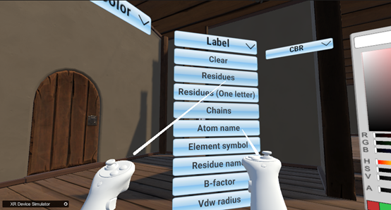
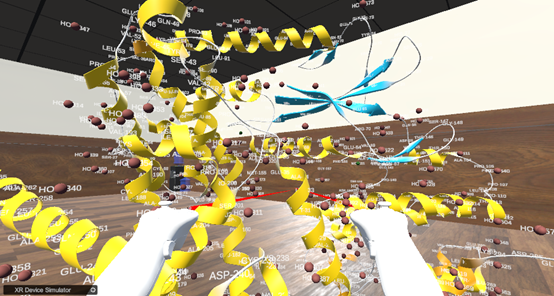
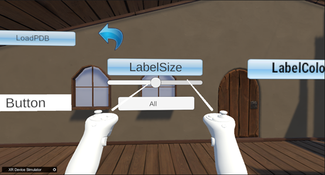
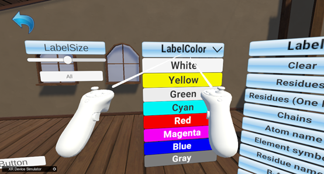
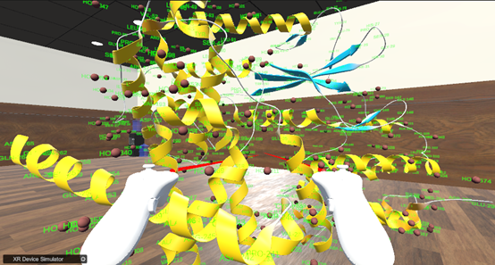

如何显示标签（以6p8e.pdb为例）：  
1. 如下图所示，在Label下拉栏下选择需要显示的标签  
  
&emsp;&emsp;&emsp;&emsp;&emsp;&emsp;&emsp;&emsp;&emsp;&emsp;&emsp;&emsp;&emsp;&emsp;
图16.Label下拉列表  
  
&emsp;&emsp;&emsp;&emsp;&emsp;&emsp;&emsp;&emsp;&emsp;&emsp;&emsp;&emsp;&emsp;&emsp;
图17.带有分子标签的模型  
2. 如下图所示，通过LabelSize下的滑动条调整Label字体大小：  
  
&emsp;&emsp;&emsp;&emsp;&emsp;&emsp;&emsp;&emsp;&emsp;&emsp;&emsp;
图18.LabelSize滑动条，调整标签大小  
3. 如下图所示，通过LabelColor切换Label颜色：  
  
&emsp;&emsp;&emsp;&emsp;&emsp;&emsp;&emsp;&emsp;&emsp;&emsp;&emsp;
图19.LabelColor下拉栏，调整Label颜色  
4. 如下图所示，切换绿色后的标签  
  
&emsp;&emsp;&emsp;&emsp;&emsp;&emsp;&emsp;&emsp;&emsp;&emsp;&emsp;&emsp;
图20.切换完颜色后绿色的标签  
