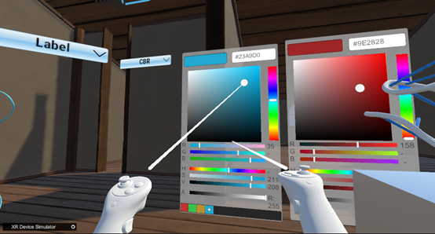
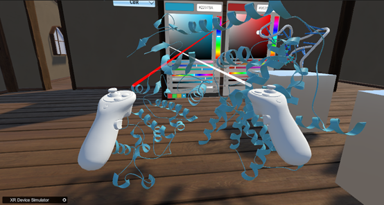

如何更改模型颜色（以6p8e.pdb为例）：  
1. 如下图所示，在右侧调色板选择颜色：  
  
&emsp;&emsp;&emsp;&emsp;&emsp;&emsp;&emsp;&emsp;&emsp;&emsp;&emsp;&emsp;&emsp;&emsp;&emsp;
图10. 调色板  
2. 如下图所示，选择完颜色的模型：  
  
&emsp;&emsp;&emsp;&emsp;&emsp;&emsp;&emsp;&emsp;&emsp;&emsp;&emsp;&emsp;&emsp;&emsp;
图11. 选择完颜色的模型  
