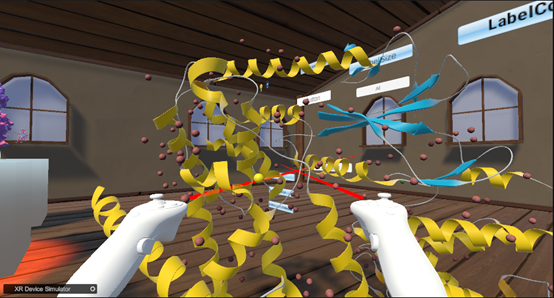
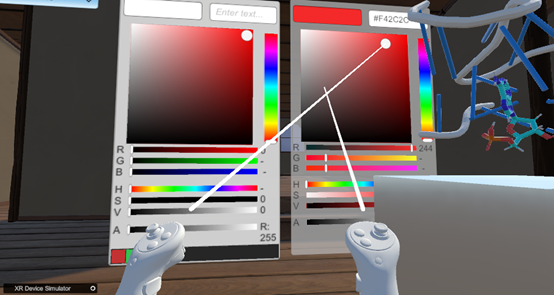

如何测量分子间距离（以6p8e.pdb为例）：  
1. 如下图所示，选择两个分子  
  
&emsp;&emsp;&emsp;&emsp;&emsp;&emsp;&emsp;&emsp;&emsp;&emsp;&emsp;&emsp;&emsp;&emsp;
图12. 首先选择第一个分子  
2. 如下图所示，选择完分子后，他们之间有一条线连接，上面会显示距离  
  
&emsp;&emsp;&emsp;&emsp;&emsp;&emsp;&emsp;&emsp;&emsp;&emsp;
图13. 选择两个分子后，测量两个分子的距离  
3. 如下图所示，通过调色板调整线条的颜色  
  
&emsp;&emsp;&emsp;&emsp;&emsp;&emsp;&emsp;&emsp;&emsp;&emsp;&emsp;&emsp;&emsp;&emsp;
图14. 测距线的调色板设置  
  
&emsp;&emsp;&emsp;&emsp;&emsp;&emsp;&emsp;&emsp;&emsp;&emsp;&emsp;&emsp;&emsp;&emsp;
图15.更改颜色后的测距线  
